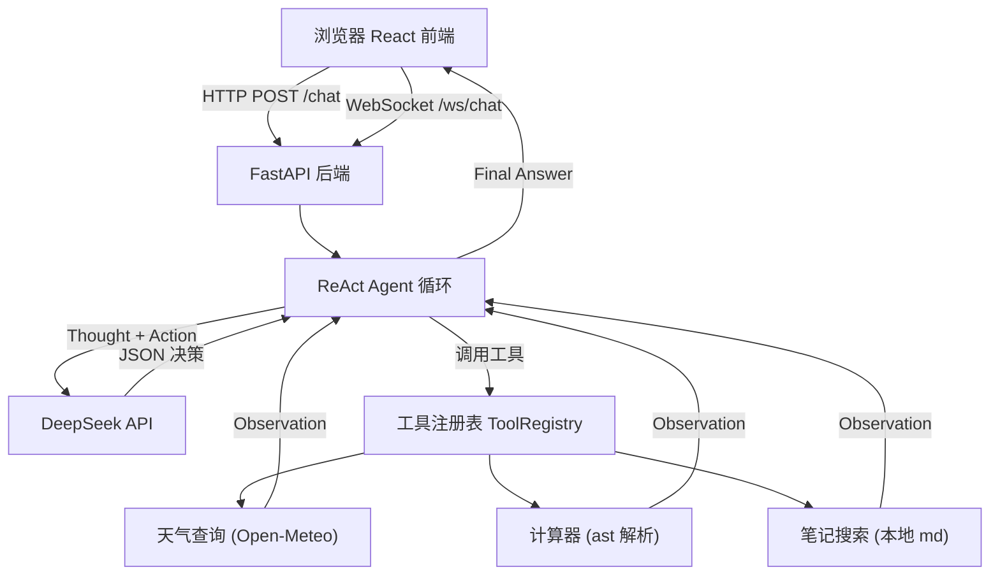

# Personal Assistant Bot

基于 **ReAct 循环** 的智能个人助理，支持天气查询、计算器、本地笔记搜索三大工具，流式输出 + 工具调用过程可视化。

## 截图

> 启动后访问 `http://localhost:5173`，连续提问体验完整 ReAct 循环。

| 聊天界面 | 工具调用卡片 |
|---------|------------|
|  |  |

<!-- 截图放到 docs/ 目录，截图后取消上面注释 -->

## 架构图



## 技术栈

| 层 | 技术 | 说明 |
|---|------|------|
| Python 环境 | `uv` | 管理 Python 版本、虚拟环境、依赖 |
| 后端 | FastAPI + uvicorn | REST + WebSocket，Pydantic 校验 |
| 大模型 | DeepSeek API | OpenAI 兼容接口，支持流式 |
| 前端 | React + TypeScript + Vite | 主流 React 工程化方案 |
| 样式 | Tailwind CSS | 快速搭建聊天 UI |
| 测试 | pytest | 35 个测试用例，覆盖 Agent/工具/API |
| Lint | ruff (Python) + oxlint (TS) | 代码规范检查 |

## 环境要求

- Python 3.12+
- [uv](https://docs.astral.sh/uv/) (Python 包管理)
- Node.js 18+ / pnpm
- DeepSeek API Key

## 快速启动

### 1. 配置 API Key

```bash
cd backend
cp .env.example .env
# 编辑 .env，填入你的 DEEPSEEK_API_KEY
```

### 2. 启动后端

```bash
cd backend
uv sync                          # 安装依赖
uv run uvicorn app.main:app --reload --port 8000
```

### 3. 启动前端

```bash
cd frontend
pnpm install                     # 安装依赖
pnpm dev                         # 启动开发服务器
```

### 4. 访问

浏览器打开 `http://localhost:5173`，开始对话。

## 目录结构

```
personal-assistant-bot/
├── backend/                     # Python 后端
│   ├── src/app/
│   │   ├── main.py              # FastAPI 入口、CORS、路由
│   │   ├── schemas.py           # Pydantic 请求/响应模型
│   │   ├── config.py            # 读取 .env 配置
│   │   ├── llm.py               # DeepSeek 客户端封装
│   │   ├── agent.py             # ReAct 主循环
│   │   └── tools/
│   │       ├── spec.py          # ToolRegistry 注册表
│   │       ├── weather.py       # 天气查询 (Open-Meteo)
│   │       ├── calculator.py    # 四则运算 (ast 安全解析)
│   │       └── search_notes.py  # 本地 md 笔记搜索
│   ├── tests/                   # pytest 测试
│   ├── notes/                   # 搜索示例笔记
│   └── .env.example
├── frontend/                    # React 前端
│   └── src/
│       ├── App.tsx              # 主界面
│       ├── components/
│       │   ├── ChatMessage.tsx  # 聊天气泡
│       │   ├── ToolCallCard.tsx # 工具折叠卡片
│       │   └── MessageList.tsx  # 消息列表
│       └── hooks/
│           └── useChat.ts       # WebSocket 管理
└── README.md
```

## API 接口

### `GET /health`

```json
{ "status": "ok" }
```

### `POST /chat` (非流式)

请求:
```json
{ "message": "北京今天天气怎么样？", "history": [] }
```

响应:
```json
{
  "reply": "北京今天晴，气温 15-25°C...",
  "trace": [
    { "step": 1, "thought": "需要查天气", "tool": "get_weather_by_city", "input": {"city": "北京"}, "result": "晴..." }
  ]
}
```

### `WS /ws/chat` (流式)

客户端发送: `{"message": "北京天气", "history": []}`

服务端按顺序推送事件:

| type | 说明 |
|------|------|
| `tool_call` | 工具调用开始 (thought, tool, input) |
| `tool_result` | 工具返回结果 |
| `token` | 最终回答的文本片段 (逐 token) |
| `done` | 流结束 |
| `error` | 错误信息 |

## ReAct 工作原理

```
用户提问
  ↓
构造 messages (system + history + user)
  ↓
调用 DeepSeek → 解析 JSON
  ├── {"final_answer": "..."} → 返回最终回答，结束
  ├── {"action": "...", "action_input": {...}} → 执行工具
  │     ↓
  │   工具返回 Observation → 追加到 messages → 继续循环
  │
  └── 解析失败 → 重试 1 次 → 兜底回答
  ↓
最多 5 轮，超时 30 秒
```

关键设计:
- **ToolRegistry**: 带元数据的工具注册表，自动参数校验 + 异常兜底，工具报错不崩溃
- **JSON 宽松解析**: 正则提取 `{...}` 块，兼容模型夹杂文字
- **流式分离**: ReAct 决策用非流式 (需完整 JSON)，最终回答用流式 (逐 token)

## 运行测试

```bash
cd backend
uv run pytest tests/ -v          # 35 个测试
uv run ruff check src/ tests/    # lint 检查
```

## 面试题要点

<details>
<summary><b>什么是 ReAct？</b></summary>

ReAct = **Re**asoning + **Act**ing。模型在 Thought（推理）和 Action（行动）之间交替，每次行动后观察环境反馈（Observation），再继续推理，直到给出 Final Answer。

```
Thought: 用户想知道北京天气，我需要调用天气工具
Action: get_weather_by_city
Action Input: {"city": "北京"}
Observation: 晴，15-25°C
Thought: 已拿到天气数据，可以回答了
Final Answer: 北京今天晴，气温 15-25°C
```
</details>

<details>
<summary><b>Agent 和普通 LLM API 调用的区别？</b></summary>

| | 普通 LLM 调用 | Agent |
|---|---|---|
| 交互 | 一次请求 → 一次响应 | 多轮循环（推理→行动→观察） |
| 工具 | 不能调用外部工具 | 可以调用工具、读取结果 |
| 信息 | 只有对话历史 | 能访问实时外部信息 |
| 核心 | 无循环 | ReAct 循环是核心 |

Agent 的核心是 **循环**：推理→行动→观察→再推理，普通 API 调用只是这个循环中的一步。
</details>

<details>
<summary><b>为什么用 WebSocket 而不是纯 HTTP？</b></summary>

HTTP 是请求-响应模式，用户必须等完整回答。WebSocket 支持服务端主动推送，实现：
- 逐 token 流式输出（打字效果）
- 工具调用事件实时推送（tool_call → tool_result）
- 一次连接多次通信，减少握手开销
</details>

## License

MIT
